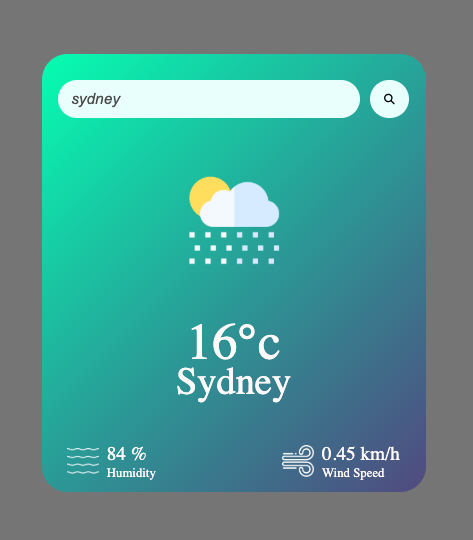

# Weather App

A simple weather app that displays current weather conditions for cities across the globe.

---

## Features

- Search any city and get current weather info instantly.  
- Displays temperature, weather condition, humidity, and wind speed.
- Uses live data from the OpenWeatherMap API.
- Clean and minimal UI.
- Responsive design for all screen sizes.

---

## Tech Stack

- HTML, CSS, JavaScript  
- OpenWeatherMap API for fetching weather data  
- Fetch API for asynchronous data calls  

---

## Demo

Check out the live version here [Live Demo](https://dinesh-bazgain.github.io/Weather-App/)

---

## Getting Started

### Prerequisites

- A modern web browser (Chrome, Firefox, etc.)  
- Internet connection

### How to Run

- Clone the repo: => git clone https://github.com/dinesh-bazgain/Weather-App.git
- Open the index.html file in your browser (no server needed!)
- Type a city name and click the Search button.

### Usage
- Type the name of any city in the input field.
- Click the search icon or hit enter.
- Get the current weather instantly!

### Known Issues
- No forecast or hourly data (yet).
- Styling may vary across older browsers.
- UI could be improved for accessibility

### Future Improvements
- Add hourly and weekly forecasts
- Dark/light mode toggle
---

## License

MIT License © 2025 Dinesh Bajgain

---

## Contact

Feel free to reach out to me via [email](dinesh.bazgain@gmail.com) or open an issue on GitHub!

---

### Happy coding and converting!!!

